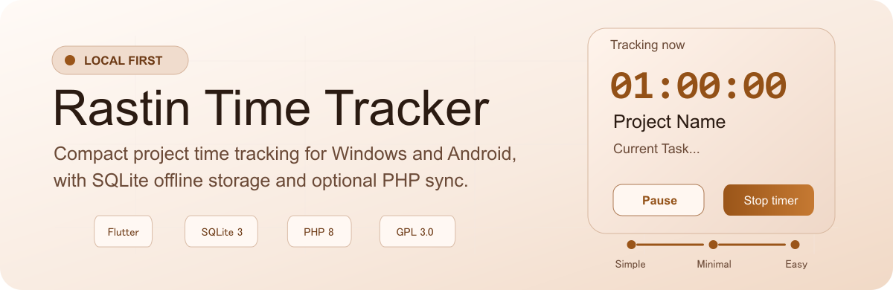
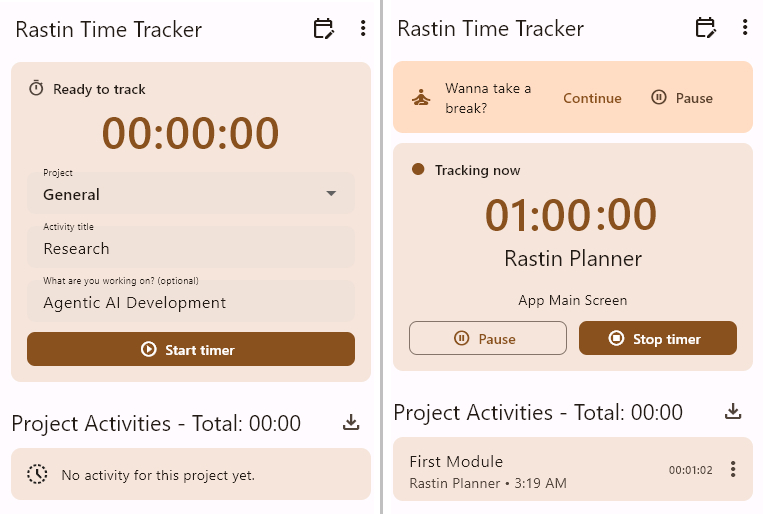

<p align="center">
  
</p>

# Rastin Time Tracker

Rastin Time Tracker, or RTT, is a compact personal time tracking application for Windows and Android. It is inspired by [Baralga](https://github.com/Baralga/baralga) and rebuilt with Flutter, Dart, SQLite 3, and an optional self-hosted PHP 8 + SQLite sync service.

RTT is local-first. The application works fully offline with a local SQLite database, while Remote Mode can synchronize data through a small framework-free PHP service hosted on a personal server or shared hosting account.

License: GPL-3.0-or-later. See [`LICENSE`](./LICENSE).

## Preview

<p align="center">
  
</p>


## Features

- Project-based time tracking.
- Activity title and activity description fields.
- Start, pause, resume, and stop timer workflow.
- Multiple pause intervals per entry.
- Pause-aware duration totals.
- Project activity total displayed as `HH:MM`.
- Project and activity CRUD.
- CSV export for a single project or all projects.
- Local Mode using SQLite 3.
- Remote Mode using a self-hosted PHP 8 + SQLite sync service.
- Light and dark color modes.
- Five preset UI font sizes.
- Break reminders with optional reminder sound.
- Bundled app icon and default reminder audio.

## Platform support

| Feature | Windows | Android |
| --- | --- | --- |
| Local SQLite database | Yes | Yes |
| Remote PHP sync | Yes | Yes |
| CSV export | Folder picker | Android document picker |
| Timer indicator | Window/taskbar title: `RTT • HH:MM:SS` | Ongoing notification |
| Timer notification controls | Not applicable | Pause/Resume and Stop actions |
| Minimize to tray | Yes | Not applicable |
| Portable mode | Yes | Not applicable |
| Custom reminder sound | Yes | Yes |
| Local database file picker | Yes | Not enabled on Android |

## CSV export

RTT exports activities with explicit date, time, pause, and duration columns:

```csv
Project,Title,Description,Started Date,Started Time,Ended Date,Ended Time,Paused Duration,Duration
Example Project,Design review,Polish settings UI,2026-08-10,11:00:00,2026-08-10,12:00:00,00:15:00,00:45:00
```

- Dates use `YYYY-MM-DD`.
- Times use `HH:MM:SS`.
- `Paused Duration` is the total paused time for the entry.
- `Duration` is the actual tracked time after deducting pauses.

## Remote Mode

Remote Mode uses a small personal sync service rather than a hosted web application.

```text
Flutter app
  └─ HTTPS JSON sync
      └─ PHP 8 scripts
          └─ SQLite 3 database
```

The service is designed to run without a PHP framework and can be hosted on typical PHP shared hosting environments.

Server setup:

1. Upload the PHP service.
2. Point the web root to `server/public/`.
3. Open `installer.php` in a browser.
4. Generate or enter a 32+ character sync key.
5. Save the generated configuration.
6. Configure the service URL and sync key in RTT Remote Mode.
7. Delete `installer.php` after installation.

The server stores a password hash of the sync key. Client records use UUID-based synchronization with a stored cursor for push/pull sync.

## Release builds

Release artifacts are generated outside the source repository and should be attached to GitHub Releases.

### Android

Universal APK:

```powershell
cd app
flutter build apk --release
```

Split APKs by Android ABI:

```powershell
cd app
flutter build apk --release --split-per-abi
```

Android App Bundle:

```powershell
cd app
flutter build appbundle --release
```

Flutter's standard Android split APK output targets `armeabi-v7a`, `arm64-v8a`, and `x86_64`.

Before public distribution, configure a private Android release keystore. The development build configuration may use debug signing for local testing.

### Windows

Build the Windows desktop app:

```powershell
cd app
flutter build windows --release
```

Create NSIS packages:

```powershell
cd packaging/windows
makensis rtt_installer.nsi
makensis rtt_portable.nsi
```

The standard installer installs RTT under the user's local application folders. The portable package writes `portable.flag`, allowing RTT to keep its default SQLite database beside the executable.

Flutter's current Windows desktop toolchain targets x64.

## Repository layout

```text
app/              Flutter/Dart application
server/           PHP 8 + SQLite sync service
docs/             Architecture and project documentation
packaging/        Windows NSIS packaging scripts
scripts/          Build helper scripts
contracts/        Sync/API contract notes
assets/readme/    README visual assets
```

Generated build artifacts, local databases, local configuration files, agent folders, and release binaries are intentionally excluded from the source repository.

## Development

Requirements:

- Flutter and Dart SDK
- Android SDK for Android builds
- Visual Studio Build Tools for Windows desktop builds
- PHP 8 with SQLite enabled for Remote Mode
- NSIS for Windows setup packages

Install dependencies:

```powershell
cd app
flutter pub get
```

Run on Windows:

```powershell
cd app
flutter run -d windows
```

Run on Android:

```powershell
cd app
flutter run -d android
```

## Project goals

RTT is a personal time tracker. It intentionally avoids team accounts, multi-user permissions, heavy web frameworks, and SaaS assumptions. The goal is to keep time tracking simple, local-first, portable, and self-hostable.

## License

Rastin Time Tracker is licensed as GPL-3.0-or-later. See [`LICENSE`](./LICENSE).
